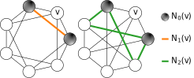
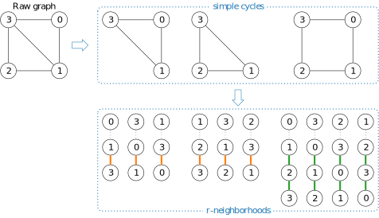
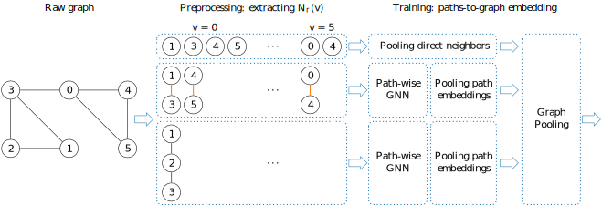

# Weisfeiler and Leman Go Loopy
+ [Code Structure](#code-structure)
    - [r-neighborhoods](#r-neighborhoods)
    - [Loopy Layer](#loopy_layer)
+ [Experiments](#experiments)

# Code Structure
You can use r-neighborhoods in your project by importing the following modules
```bash
├── src/
    └── data/
        └── custom_collate.py   # collate function that accounts for r-neighborhoods
    └── transforms/
        └── r_neighborhood.py   # build the r-neighborhood of each node in the graph
    └── nn/
        └── loopy.py   # class definition of loopy layers that process r-neighborhoods
```
and modifying them according to your needs.

## r-neighborhoods
Given an input graph $G$ and a node $v$, the ``r-neighborhood`` $\mathcal{N}_r(v)$ of $v$ is defined as the collection of simple paths of length $r$ between its distinct neighborhoods.
<center>

</center>

The computation of r-neighborhoods uses the ``networkx.simple_cycles`` function, which return simple cycles of the input graph $G$. The paths are then obtained as cyclic permutations of the simple cycles: the first node is the neighborhood center, while the others form the path.
<center>

</center>

The paths are usually computed in the preprocessing step. However, this could lead to memory overload, especially when $G$ is dense. In order to prevent OOM, we also provide a ``--lazy`` flag, which postpone the computation of cyclic permutation to the forward step. In this way, we don't store all paths for each graph in the dataset; rather, we compute them on the flight.

---

## Loopy Layers
$r$-neighborhoods are then fed into a path-wise layer, which compute for each path an embedding. The embeddings are then processed together to get an embedding of the central node $v$.
<center>

</center>
In our code, we use GIN layers to process paths, as it is simple but maximally expressive on paths. You can choose a different neural architecture. Note that messages on paths are transmitted via ``torch.nn.functional.conv3d`` with kernel $[1, 0, 1]$, since only consecutive nodes are linked.

To limit the number of learnable parameters, we provide a ``--shared`` flag: it guarantees that in each loopy layer we have shared weights among paths of different lengths.

To implement the pooling operations, we use ``segment_csr``  instead of ``scatter``: the former is fully-deterministic, as noted in the [documentation](https://pytorch-scatter.readthedocs.io/en/latest/functions/segment_csr.html). When indices are not unique, the behavior of ``scatter`` is non-deterministic: one of the values from ``src`` will be picked arbitrarily and the gradient propagated to all elements with same index, resulting in an incorrent gradient computation.

---

# Experiments

The hyperparams used for the experiments can be retrieved from the folder
```bash
├── scripts/
```
You can reproduce the results by typing
```bash
bash scripts/<dataset_name>.sh
```
or you can specify your own configuration as
```bash
python run_model.py --dataset zinc_subset --r 5
```
Note that for ``subgraphcount`` you need to specify the length of the cycle as ``subgraphcount_<n>`` with $n\in\{3, 4, 5, 6\}$, i.e., by calling
```bash
python run_model.py --dataset subgraphcount_3 --r 1
```
Similarly, you can specify the regression target of ``qm9`` by ``qm9_<n>`` where $n$ is the columns index of the target. For ``brec``, you need to specify the name of the raw file, i.e., ``brec_<name>`` where name is one among ``basic``, ``extension``, ``regular``, ``4vtx`` (for 4-vertex condition), ``dr`` (for distance regular), ``str`` (strongly regular), and ``cfi``. Moreover, ``exp_iso`` is the name given to ``exp`` when the task is to count the number of indistinguishable pairs.

|r|Train MAE $\downarrow$| Test MAE $\downarrow$|
|:--:|:--:|:--:|
|0| $0.106 \pm 0.001$ | $0.1136\pm0.0005$|
|1| $0.063 \pm 0.002$ | $0.079 \pm 0.001$|
|2| $0.0037 \pm 0.0009$ | $0.018\pm0.006$ |